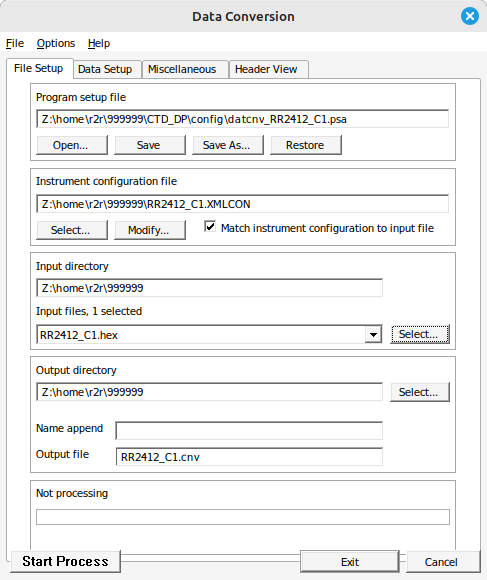
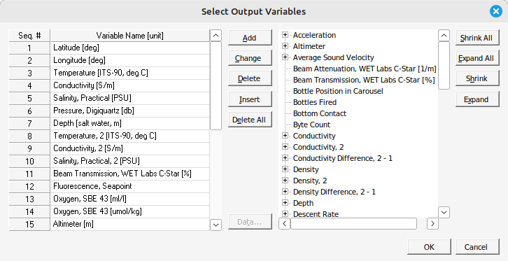

Web app to display Seabird Scientific data for CTD
-----------------------------------------------------

Step 1: Process the raw CTD data with Sea-Bird's SBEDataProcessing Software on a Windows computer

Step 2: Download the git repository and install the dependencies

Step 3: Run the script to display the plots

Step 1: SBEDataProcessing Software
-----------------------------------------------------
**Run -> Data Conversion**

On the Data Conversion window, **File Setup** tab: 
```
Program setup file: This is the path to the .psa file which can be found in the raw ctd data directory

Instrument configuration file: This points to the path of the .XMLCON file for a ctd cast

Input Directory: Path to the raw ctd data directory

Input file: the .hex file in the input directory for a ctd cast

Output directory: Path to the processed .cnv ctd data file

Output file: Name of the file which usually should mention the ctd cast name
```



On the Data Conversion window, **Data Setup** tab:
```
Output format: ASCII

Convert data from: Upcast and Downcast

Create file type: .CNV file only

Select Output Variables Tab:
Add any additional variables required. Remove the Time, System [seconds] variable.

Recommend Variables: Depth, Latitude [deg], Longitude [deg], Conductivity [S/m] 1&2, Salinity [PSU] 1&2, Temperature [ITS-90, deg C] 1&2, Oxygen [ml/l] [umol/kg], Pressure [db], 


Start Process
```



Step 2: Download this repository
-----------------------------------------------------

Dependencies required: mojolicious.org

To install Mojolicious via the terminal:

```
$ sudo cpan
$ cpan
> install Mojolicious
> exit
```

Modules required for the plotting routine:

```
$ sudo cpan App::cpanminus 
$ sudo cpanm Mojolicious
$ sudo cpan Array::Utils
$ sudo cpan Class::Struct
```

To check if install is complete:

```
$ mojo version
```

Note: The app uses these libraries but they are shipped with the source code:
1. https://plotly.com/javascript 
2. https://fabianlindfors.se/multijs/

Step 3: Run the script
-----------------------------------------------------
Note the processed CTD data directory. The default data dir is /home/data/ctd/

To run as a background process:
```
$ nohup ./ctdplot.pl -d <ctd_dir> daemon -l http://<ip_addr>:<port> &
```

Example:
```
$ nohup ./ctdplot.pl -d /home/data/ctd/ daemon -l http://192.168.1.110:8080 &
```
IMPORTANT: the dir where the processed CTD data is needs to end with a backslash.

On a Windows system the script can be run with:
```
$ Start-Process "perl" -ArgumentList "ctdplot.pl", "-d", "ctd_dir", "daemon", "-l", "http://127.0.0.1:<port>"
```

Note even though it says it's a daemon, it isn't. 
So need to run as a background process with nohup.


